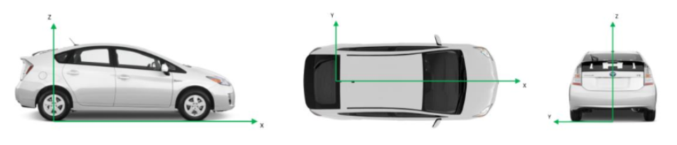
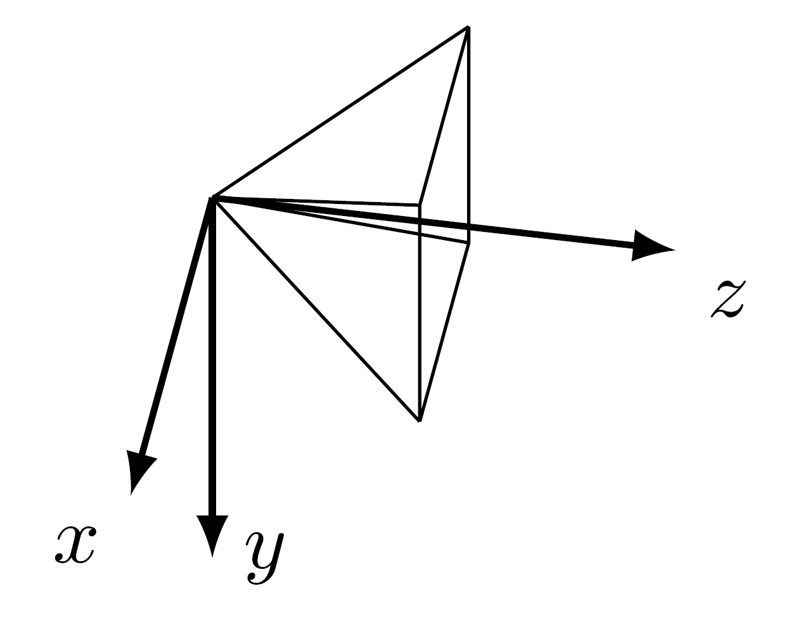
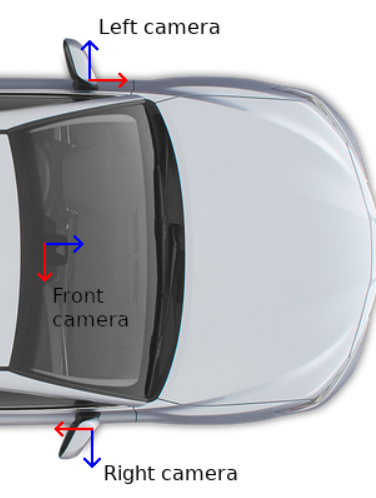

# aiMotive 3D Traffic Light and Traffic Sign Dataset
This repository stores the dataset introduced in the 'Accurate 3D Automatic Annotation of Traffic Lights and Signs for Autonomous Driving' paper. The dataset consists of 3D bounding boxes of traffic lights and traffic signs up to 200 meters from the ego vehicle.

## Abstract
3D detection of traffic management objects, such as traffic lights and road signs, is vital for self-driving cars, particularly for address-to-address navigation where vehicles encounter numerous intersections with these static objects. We introduce a novel method for automatically generating accurate and temporally consistent 3D bounding box annotations for traffic lights and signs, effective up to a range of 200 meters. These annotations are suitable for training real-time models used in self-driving cars, which need a large amount of training data. The proposed method relies only on RGB images with 2D bounding boxes of traffic management objects, which can be automatically obtained using an off-the-shelf image-space detector neural network, along with GNSS/INS data, eliminating the need for LiDAR point cloud data.

### Download
The dataset is made freely available for non-commercial research purposes only. The full dataset (~107 GB) can be downloaded from this [link](https://aimotive-dataset.s3.amazonaws.com/aimotive_tl_ts_dataset.zip).
Another option is to use wget for downloading.
```
wget https://aimotive-dataset.s3.amazonaws.com/aimotive_tl_ts_dataset.zip
```
Yet another option is [AWS Command Line Interface](https://aws.amazon.com/cli/).
```
aws s3 cp --no-sign-request s3://aimotive-dataset/aimotive_tl_ts_dataset.zip .
```

### Videos
https://github.com/user-attachments/assets/f636a985-f7c9-48a2-a7ec-193f693f86ec

https://github.com/user-attachments/assets/bad33f4b-809f-436d-966c-254e2428fe60

https://github.com/user-attachments/assets/011a83e1-113a-4c7b-bc7b-af8fa8aa8d43

### File structure description

Below you can see the file structure of the dataset. In the root directory the dataset is sorted into four different operational design domains (ODDs): highway, night, rainy and urban. In each ODD you can find sequence folders that contain 15 sec long records. Under each sequence folder there is a sensor directory containing the calibration, camera image and GNSS/INS data as well as the traffic_light and traffic_sign folders with the relevant 3D annotation data.

```
ODD[highway/night/rainy/urban]                                  # main folder for all the sequences within an ODD
│
└───sequence_folder_1                                           # sequence ID e.g.: 20231006-114522-00.15.00-00.15.15@Sogun
│   │
│   └───sensor                                                  # folder for the exported sensor data in generic format
│   │   │   
│   │   └───calibration                                         # folder for sensor calibration and session description meta files
│   │   │   │   calibration.json                                # calibration parameters for each sensor
│   │   │   │   extrinsic_matrices.json                         # calibration parameters for each sensor
│   │   │
│   │   └───camera                                              # a folder for camera sensor data export
│   │   │   │
│   │   │   └───F_CTCAM_L
│   │   │   │   │   F_CTCAM_L_0000001.jpg
│   │   │   │   │   ...
│   │   │   │
│   │   │   └───F_CTCAM_R
│   │   │   │   │   F_CTCAM_R_0000001.jpg
│   │   │   │   │   ...
│   │   │   │
│   │   │   └───F_LONGRANGECAM_C
│   │   │   │   │   F_LONGRANGECAM_C_0000001.jpg
│   │   │   │   │   ...
│   │   │   │
│   │   │   └───F_MIDRANGECAM_C
│   │   │       │   F_MIDRANGECAM_C_0000001.jpg
│   │   │       │   ...
│   │   │
│   │   └───gnssins                                             # a folder for the post-processed GNSS-INS-based trajectory
│   │       │   egomotion2.json                                 # a file containing position and orientation information in ECEF coordinate system for each camera frame's timestamp
│   │
│   └───traffic_light                                           # a folder for the traffic light auto annotation results
│   │   │
│   │   └───box                                                 # a folder for the calculated bounding boxes and metadata of traffic light objects in the session
│   │       │
│   │       └───3d_body                                         # the output folder for the annotation
│   │           │   frame_0000001.json                          # a file containing annotations of traffic light objects at a timestamp. The timestamp is aligned with a camera frame, which is reflected in the name of the file. e.g.: frame_0002051.json 
│   │           │   ...
│   │
│   └───traffic_sign                                            # a folder for the traffic sign auto annotation results
│       │
│       └───box                                                 # a folder for the calculated bounding boxes and metadata of traffic sign objects in the session
│           │
│           └───3d_body                                         # the output folder for the annotation
│               │   frame_0000001.json                          # a file containing annotations of traffic sign objects at a timestamp. The timestamp is aligned with a camera frame, which is reflected in the name of the file. e.g.: frame_0002051.json 
│               │   ...
│    
└───sequence_folder_2
│   │   ...
│   ...
```

### Sensor setup

#### 4x camera

- Sony [IMX490](https://www.sony-semicon.com/files/62/pdf/p-15_IMX490.pdf) (front & cross-traffic cams)
- 30 to 40 Hz capture frequency
- 1/1.55'' CMOS sensor of 2896 x 1876 resolution

#### 1x IMU + GPS

- Novatel PwrPak7
- Up to 100 Hz measurement frequency
- Position accuracy of 100 mm (RTK)
- Heading accuracy of 0.08° (baseline = 2m)
- Roll & pitch accuracy of 0.02°

### Coordinate systems

The reference coordinate system used for defining the annotated objects is called the body coordinate system. The body coordinate system is a coordinate system that is attached to the object holding the sensor system; for example, the vehicle body. The origin is the projected ground plane point under the center of the vehicle’s rear axis at nominal vehicle body height and zero velocity. If looking towards the vehicle’s forward direction from the driver’s point of view, then:

- the X-axis points forward along the vehicle body,
- the Y-axis points left to the vehicle body,
- and the Z-axis points up along the vehicle body,
- where the measurement unit is defined in meters. The body coordinate system is depicted below:



For cameras, the camera coordinate system can be used for projecting 3D points onto the camera image and vice versa. The origin is the camera’s viewpoint and the axes are defined as follows:

- +X is right
- +Y is down
- +Z is forward (viewing into the scene),
- where the measurement unit is defined in meters. The camera coordinate system is depicted below:



The sensor layout is illustrated by the following figure:



### Sensor synchronization

- All of the recorded sensors are synchronized.
- The annotation files (named frame_#.json, where # refers to the camera frame identifier number) contain the traffic light and sign objects on the given camera frame.
- The camera sensors are rolling shutter-type sensors. This means that the exposure starts from the top of the sensor, going downwards, row by row.

### Updates
- [Aug 27, 2024] Descriptions added for file structure, sensor setup and coordinate systems.
- [Aug 13, 2024] We released the 3D Traffic Light and Traffic Sign dataset.

### TODO
- Upload the dataset loader and visualizer
- Add citation
